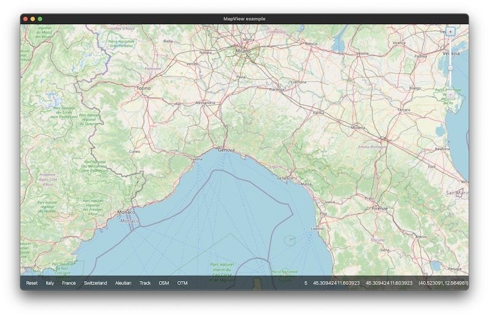
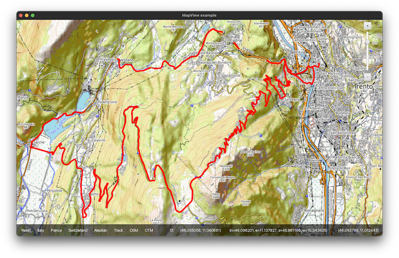

[](https://services.tidalwave.it/ci/view/MapView)
[](https://services.tidalwave.it/ci/view/MapView)
[](https://services.tidalwave.it/ci/view/MapView)

MapView
================================

MapView is a simple JavaFX 2 control that can render a tile-based map. It offers the following features:

+ zooming in/out
+ dragging
+ centering on double click
+ rendering overlays, such as GPS tracks



It works with map systems based on the Mercator projection, such as [OpenStreetMap](https://openstreetmap.org) or [OpenTopoMap](https://opentopomap.org/).



To get started, look at the example in the code and the
[Javadoc](http://tidalwave.it/projects/mapview/latest/it-tidalwave-mapview-modules/mapview-javafx/apidocs/index.html).
To run the example launch:

```shell
mvn install -DskipTests
mvn -f modules/Example/pom.xml -Pjavafx-run
```

As an historical note, MapView has been derived by Windrose, an old open source GPS navigation project for Java Mobile developed by the same author between
2006 and 2008 (even though in the end only a few lines of code have been retained).

MapView has been developed because a map viewer is needed by a project of the same author and the existing similar components for JavaFX, at the end of 2024,
seem to be abandoned or not working. If you need a bug fix or an enhancement, requests, contributions such as patches, pull requests etc... are welcomed.

MapView requires and is tested with JDKs in this range: [21, 22).
It is released under the [Apache Licence v2](https://www.apache.org/licenses/LICENSE-2.0.txt).

Please have a look at the [project website](https://tidalwave.bitbucket.io/mapview) for a quick introduction with samples, tutorials, JavaDocs and build reports.


Bootstrapping
-------------

In order to build the project, run from the command line:

```shell
mkdir it-tidalwave-mapview
cd it-tidalwave-mapview
git clone https://bitbucket.org/tidalwave/mapview-src .
mvn -DskipTests
```

The project can be opened with a recent version of the [IntelliJ IDEA](https://www.jetbrains.com/idea/), 
[Apache NetBeans](https://netbeans.apache.org/) or [Eclipse](https://www.eclipse.org/ide/) IDEs.


Contributing
------------

Pull requests are accepted via [Bitbucket](https://bitbucket.org/tidalwave/mapview-src) or [GitHub](https://github.com/tidalwave-it/mapview-src). There are some guidelines which will make 
applying pull requests easier:

* No tabs: please use spaces for indentation.
* Respect the code style.
* Create minimal diffs — disable 'on save' actions like 'reformat source code' or 'organize imports' (unless you use the IDEA specific configuration for 
  this project).
* Provide [TestNG](https://testng.org/doc/) tests for your changes and make sure your changes don't break any existing tests by running
```mvn clean test```. You can check whether there are currently broken tests at the [Continuous Integration](http://services.tidalwave.it/ci/view/MapView) page.

If you plan to contribute on a regular basis, please consider filing a contributor license agreement. Contact us for
 more information.


Additional Resources
--------------------

* [Issue tracking](http://services.tidalwave.it/jira/browse/MV)
* [Continuous Integration](http://services.tidalwave.it/ci/view/MapView)
* [Sonar](https://sonarcloud.io/summary/overall?id=tidalwave_mapview-src&branch=master)
* [Tidalwave Homepage](http://tidalwave.it)
